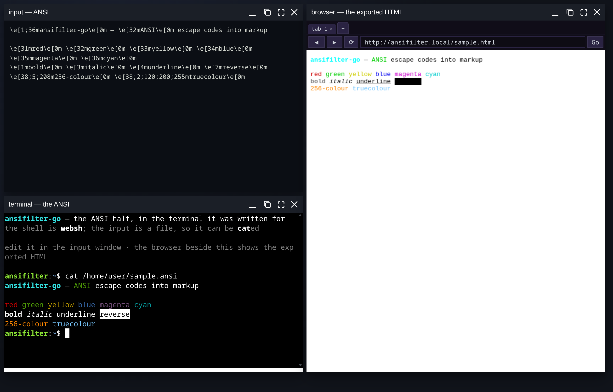
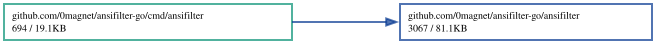

# ansifilter-go

A Go port of [ansifilter](https://gitlab.com/saalen/ansifilter) 2.23 by André
Simon. It converts text containing ANSI terminal escape codes into text, HTML,
Pango markup, LaTeX, plain TeX, RTF, BBCode or SVG.

**[Live demo](https://0magnet.github.io/ansifilter-go/)** — the same input in both renderers at once: the ANSI in a real terminal, the exported HTML in a real browser.



The two halves of this tool are escape codes going in and markup coming out,
and a page that draws its own approximation of either is showing the
approximation. So the demo is a [desk](https://github.com/0magnet/desk): the
terminal is [websh](https://github.com/0magnet/websh) on
[xterm-go](https://github.com/0magnet/xterm-go), the browser is
[netscrape](https://github.com/0magnet/netscrape), and each renders the same
input its own way in a window of its own. The input is written into the
shell's filesystem, which is why the terminal can `cat` it — nothing is being
simulated for the demo's benefit.

It lives in its own module under `demo/`, so none of that reaches this
library: `go.mod` here still has no dependencies, and the graph below is still
the port's own.

The port is **byte-exact**: for every input and option combination tested it
produces output identical to the C++ original.

## Why

The existing Go libraries for ANSI-to-HTML do not agree with ansifilter. For
the same input, `robert-nix/ansihtml` emits:

| | ansifilter | ansihtml |
|---|---|---|
| 16-colour | `color:#cd0000` (xterm hex) | `color:sienna` (CSS name) |
| 256/truecolour | `#ff8700` | `rgb(255,135,0)` |
| underline | `text-decoration:underline` | `text-decoration-line:underline` |
| reverse video | swaps to explicit fg/bg | `filter:invert(100%)` |
| document mode | full HTML + CSS, fragments, anchors, line numbers | spans only |

That is a structural difference, not a cosmetic one, so this is a port rather
than a fork.

## Install

```
go install github.com/0magnet/ansifilter-go/cmd/ansifilter@latest
```

## Use

The command line matches the original:

```
ansifilter -H -f -i input.ansi -o output.html
img2txt -W 80 -f ansi image.png | ansifilter -H -f
ansifilter --art-cp437 -H input.ans > art.html
```

Run `ansifilter --help` for the full option list. All of the original's
options are implemented: the eight output formats, ANSI-art modes
(`--art-cp437`, `--art-bin`, `--art-tundra`), colour maps, line numbers and
anchors, line wrapping, derived stylesheets, tee mode and tail mode.

## Library

```go
import "github.com/0magnet/ansifilter-go/ansifilter"

g := ansifilter.New(ansifilter.HTML)
g.SetFragmentCode(true)
html := g.GenerateString("\033[31mred\033[0m")
// <span style="color:#cd0000;">red</span>
```

`Generate(io.Reader, io.Writer)` streams, and `GenerateFile` mirrors the CLI.

## Verification

`ansifilter-go` was diffed against a reference build of ansifilter 2.23
compiled from the upstream source:

| Suite | Comparisons | Result |
|---|---|---|
| Corpus × 62 option sets | 1,482 | all identical |
| Fuzz seeds 1–400 × 17 option sets | 6,800 | all identical |
| Fuzz seeds 401–2400 × 24 option sets | 48,000 | all identical |
| ANSI art (`.ans`, `.bin`, XBIN) | 15 | all identical |
| stdin, colour maps, derived styles, multi-file, tee, `-v`, `-h` | 17 | all identical |

The corpus covers every SGR code, the full 256-colour and truecolour ranges,
carriage-return overwrite, backspace overstrike, OSC 8 hyperlinks, grep-style
`ESC K` sequences, C1 control bytes, UTF-8 text and real ANSI art. The fuzzer
generates input biased towards malformed and truncated escape sequences.

## Notes on fidelity

Several C++ behaviours had to be reproduced deliberately, because ansifilter's
output depends on them:

- `std::string::substr(pos, count)` takes a *length*; when that length
  underflows `size_t` it selects the rest of the string. An OSC 8 hyperlink
  with a malformed terminator relies on this.
- `StringTools::str2num` leaves its output untouched when the input is empty,
  so `ESC[9;m` reuses code 9 for the empty field, while a non-numeric field
  resets it to 0.
- `splitString` drops interior empty fields but keeps a trailing one, and
  returns no fields at all for an empty string.
- The cursor variables used for ANSI art are `unsigned int`, so a cursor-left
  sequence past column zero wraps to a huge value and the bounds check then
  suppresses the write.
- A default-constructed `ElementStyle` has `reset` set and a background colour
  index of -1, which is what untouched ANSI-art cells carry.

## Version pinning

The version string reported by `-v` and in the generator comment is 2.23,
matching the upstream source this was ported from. Distributions may still ship
2.22, which differs only in that string, a removed `curX` clamp and an OSC
UTF-8 fix.

If you want output identical to an older release, pin it at build time:

```
go build -ldflags '-X github.com/0magnet/ansifilter-go/ansifilter.Version=2.22' ./cmd/ansifilter
```

Built that way, full-document output is byte-identical to a stock ansifilter
2.22. Alternatively `--no-version-info` drops the comment altogether, and `-f`
(fragment mode) never emits it.

## Licence

GPL-3.0-or-later, inherited from ansifilter. See `LICENSE`.

Original ansifilter is copyright © 2007-2026 André Simon
<a.simon@mailbox.org>, <http://andre-simon.de/>.

## Dependency Graph

Made with [goda](https://github.com/loov/goda):

```
go run github.com/loov/goda@latest graph github.com/0magnet/ansifilter-go/... | dot -Tsvg -o docs/ansifilter-go-goda-graph.svg
```



## Lines of Code

Made with [gocloc](https://github.com/hhatto/gocloc) (excludes `vendor/`, `node_modules/`, `.git/`):

```
gocloc --not-match-d='(vendor|node_modules|\.git)' .
```

```
-------------------------------------------------------------------------------
Language                     files          blank        comment           code
-------------------------------------------------------------------------------
Go                              15            384            346           3597
YAML                             1              0              7             98
Markdown                         1             31              0             88
-------------------------------------------------------------------------------
TOTAL                           17            415            353           3783
-------------------------------------------------------------------------------
```
